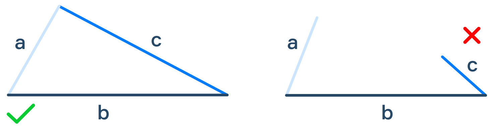

# Triangle

## Description
Given three natural numbers A, B, and C. Determine if a triangle with these sides can exist.

If the triangle exists, output the "**YES**" string; otherwise, output "**NO**".

A triangle is valid if the sum of its two sides is greater than the third side. If three sides are A, B, and C, then three conditions should be met.

```
1. A + B > C
2. A + C > B
3. B + C > A
```



## Examples
**Sample Input 1:**
```console
3
4
5
```

**Sample Output 1:**
```console
YES
```

## Tags
- basics
- control flow statements
- conditional statement